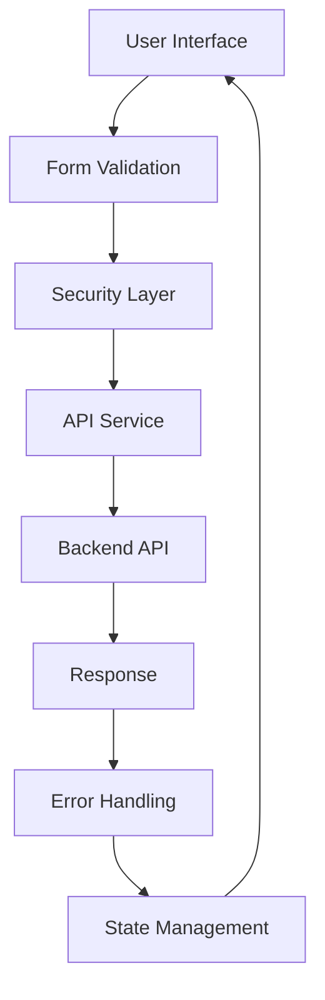

# Enterprise Architecture Documentation

## Overview

AI Navigator has been refactored to follow enterprise-grade architectural patterns with a focus on scalability, security, performance, and maintainability.

## Core Architecture Principles

### 1. **Separation of Concerns**
- Clear separation between UI, business logic, and data layers
- Service-oriented architecture for API communication
- Domain-driven design for data models

### 2. **Type Safety**
- Comprehensive TypeScript coverage with strict mode
- Zod schemas for runtime validation
- No `any` types allowed

### 3. **Error Management**
- Centralized error handling with categorization
- Error boundaries for graceful degradation
- Structured logging with multiple severity levels

### 4. **Security First**
- Input validation and sanitization
- XSS and CSRF protection
- Content Security Policy implementation
- Secure session management

### 5. **Performance Optimization**
- Code splitting and lazy loading
- Virtual scrolling for large lists
- Debouncing and throttling utilities
- Web Worker support for heavy computations

## Directory Structure

```
.
├── app/                      # Next.js App Router
│   ├── api/                 # API routes
│   ├── (auth)/             # Authentication routes
│   └── (dashboard)/        # Dashboard routes
├── components/              # React components
│   ├── ui/                 # Reusable UI components
│   ├── forms/              # Form components
│   └── layouts/            # Layout components
├── lib/                    # Core business logic
│   ├── config/             # Configuration management
│   ├── services/           # Service layer
│   ├── store/              # State management (Zustand)
│   ├── types/              # TypeScript definitions
│   ├── utils/              # Utility functions
│   ├── hooks/              # Custom React hooks
│   └── validation/         # Validation schemas
├── public/                 # Static assets
├── tests/                  # Test suites
│   ├── unit/              # Unit tests
│   ├── integration/       # Integration tests
│   └── e2e/               # End-to-end tests
└── .github/               # CI/CD workflows
```

## Key Components

### Configuration Management (`lib/config/`)
- Environment-based configuration
- Type-safe config access
- Feature flags support

### Service Layer (`lib/services/`)

#### API Service
- Centralized HTTP client with Axios
- Request/response interceptors
- Automatic retry logic
- Request caching
- CSRF token handling

#### Logger Service
- Structured logging
- Multiple log levels
- Automatic error capture
- Performance monitoring
- Remote log aggregation support

#### Error Service
- Error categorization
- Recovery strategies
- User-friendly error messages
- Automatic error reporting

### State Management (`lib/store/`)
- Zustand with TypeScript
- Persistent state with localStorage
- Optimistic updates
- DevTools integration

### Validation (`lib/validation/`)
- Zod schemas for all inputs
- File upload validation
- CSV data validation
- Form validation with react-hook-form

### Security (`lib/utils/security.ts`)
- Input sanitization
- XSS prevention
- CSRF token generation/validation
- Password strength validation
- Rate limiting utilities

### Performance Hooks (`lib/hooks/`)
- `useDebounce` - Input optimization
- `useThrottle` - Rate limiting
- `useIntersectionObserver` - Lazy loading
- `useVirtualScroll` - Large list optimization
- `useWebWorker` - Background processing
- `usePerformanceMonitor` - Performance tracking

## Data Flow



## Authentication Flow

1. User submits credentials
2. Validation with Zod schema
3. API request with CSRF token
4. JWT token received and stored
5. Automatic token refresh
6. Protected route access

## Error Handling Strategy

### Categories
- **Network Errors**: Retry with exponential backoff
- **Validation Errors**: Show inline feedback
- **Authentication Errors**: Redirect to login
- **Authorization Errors**: Show access denied
- **Business Logic Errors**: Show user-friendly message
- **System Errors**: Log and show generic message

### Recovery Strategies
- Automatic retry for transient failures
- Fallback UI for critical errors
- Offline mode support
- Session recovery

## Performance Optimizations

### Bundle Size
- Dynamic imports for code splitting
- Tree shaking with ES modules
- Compression with Brotli/Gzip
- Image optimization with Next.js Image

### Runtime Performance
- React.memo for expensive components
- useMemo/useCallback for optimization
- Virtual scrolling for large lists
- Web Workers for heavy computations
- Request debouncing/throttling

### Caching Strategy
- API response caching
- Static asset caching
- Service Worker for offline support
- CDN integration

## Security Measures

### Input Security
- All inputs validated with Zod
- SQL injection prevention
- XSS attack prevention
- File upload restrictions

### Network Security
- HTTPS only
- CSRF protection
- Content Security Policy
- CORS configuration

### Data Security
- Sensitive data encryption
- Secure session management
- PII data masking in logs
- Audit logging

## Testing Strategy

### Unit Tests
- Component testing with React Testing Library
- Service layer testing
- Utility function testing
- 80% coverage target

### Integration Tests
- API integration testing
- Database integration testing
- Third-party service testing

### E2E Tests
- Critical user flows
- Cross-browser testing
- Performance testing
- Accessibility testing

## CI/CD Pipeline

### Pre-commit
- Linting (ESLint)
- Type checking (TypeScript)
- Formatting (Prettier)
- Unit tests

### CI Pipeline
1. Code quality checks
2. Security audit
3. Test suite execution
4. Build verification
5. Bundle size check
6. Performance testing

### CD Pipeline
- Preview deployments for PRs
- Staging deployment
- Production deployment with rollback
- CDN cache purging
- Release tagging

## Monitoring & Observability

### Application Monitoring
- Error tracking with Sentry
- Performance monitoring
- User analytics
- Custom metrics

### Infrastructure Monitoring
- Server health checks
- Database monitoring
- API latency tracking
- Resource utilization

### Alerting
- Error rate thresholds
- Performance degradation
- Security incidents
- System failures

## Development Guidelines

### Code Style
- ESLint configuration
- Prettier formatting
- Conventional commits
- Code review requirements

### Best Practices
- SOLID principles
- DRY (Don't Repeat Yourself)
- KISS (Keep It Simple, Stupid)
- YAGNI (You Aren't Gonna Need It)

### Documentation
- JSDoc for functions
- README for modules
- API documentation
- Architecture decisions

## Technology Stack

### Frontend
- Next.js 14 (App Router)
- React 19
- TypeScript 5
- Tailwind CSS 4
- Framer Motion
- Recharts

### State & Data
- Zustand (State Management)
- React Query (Server State)
- Axios (HTTP Client)
- Zod (Validation)

### Development
- ESLint
- Prettier
- Jest
- React Testing Library
- Playwright (E2E)

### Infrastructure
- Vercel (Hosting)
- Cloudflare (CDN)
- GitHub Actions (CI/CD)
- Sentry (Error Tracking)

## Scalability Considerations

### Horizontal Scaling
- Stateless architecture
- Load balancing ready
- Database connection pooling
- Cache distribution

### Vertical Scaling
- Memory optimization
- CPU utilization monitoring
- Resource limits configuration

### Data Scaling
- Pagination implementation
- Virtual scrolling
- Lazy loading
- Data compression

## Future Enhancements

1. **Micro-frontend Architecture**
   - Module federation
   - Independent deployments
   - Team autonomy

2. **GraphQL Integration**
   - Efficient data fetching
   - Real-time subscriptions
   - Schema stitching

3. **Advanced Caching**
   - Redis integration
   - Edge caching
   - Predictive prefetching

4. **Machine Learning Pipeline**
   - Model serving infrastructure
   - A/B testing framework
   - Feature flag system

5. **Internationalization**
   - Multi-language support
   - Locale-based formatting
   - RTL language support


