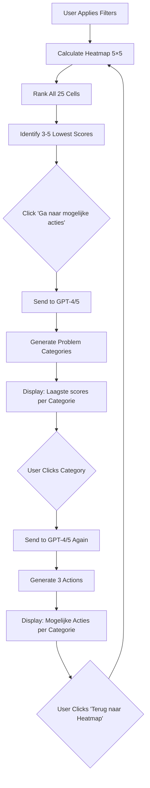

# GPT-4/5 Integration Specification
**The Core AI Feature: Problem Categories + Interventions**

## Overview
Based on the Excel screenshots, the MAIN AI feature generates:
1. **Problem Categories** from lowest heatmap scores
2. **3 Specific Actions** per category with reasoning
3. All in Dutch and English

---

## 1. THE WORKFLOW



---

## 2. EXAMPLE FROM SCREENSHOTS

### Input Data (Lowest Scores)
```javascript
{
  "filtered_respondents": 85,
  "filters": {
    "department": ["Leeg", "Asset Management", "Digitalisering", ...],
    "experience": ["<3 jaar", "3 tot 10 jaar", "10 tot 25 jaar", ">25 jaar"],
    "age": ["<25 jaar", "25-35 jaar", "35-45 jaar", "45-55 jaar", ">55 jaar"]
  },
  "lowest_cells": [
    {
      "level_id": 5,
      "level_name": "Organizational Stability at Risk",
      "level_name_nl": "Organisatorische stabiliteit in gevaar",
      "category_id": 4,
      "category_name": "AI is too Opaque",
      "category_name_nl": "AI is te ondoorzichtig",
      "score": 2.42,
      "rank": 25,
      "respondent_count": 23,
      "cell_id": "L5_C4"
    },
    {
      "level_id": 3,
      "level_name": "Professional Trust & Fairness Issues",
      "level_name_nl": "Professionele vertrouwens- en eerlijkheidskwesties",
      "category_id": 4,
      "category_name": "AI is too Opaque",
      "category_name_nl": "AI is te ondoorzichtig",
      "score": 2.77,
      "rank": 24,
      "respondent_count": 31,
      "cell_id": "L3_C4"
    },
    {
      "level_id": 3,
      "level_name": "Professional Trust & Fairness Issues",
      "level_name_nl": "Professionele vertrouwens- en eerlijkheidskwesties",
      "category_id": 3,
      "category_name": "AI is Emotionless",
      "category_name_nl": "AI is emotieloos",
      "score": 2.81,
      "rank": 23,
      "respondent_count": 28,
      "cell_id": "L3_C3"
    }
  ],
  "company_context": {
    "name": "Company XYZ",
    "industry": "Financial Services",
    "size": "500-1000",
    "ai_maturity": "early_adoption",
    "primary_concerns": ["transparency", "trust", "governance"]
  }
}
```

### GPT-4/5 Output (Problem Categories)

```javascript
{
  "problem_categories": [
    {
      "category_id": "the_risky_ai",
      "category_name": "The Risky AI",
      "category_name_nl": "De Riskante AI",
      "reason": "AI is too Opaque",
      "reason_nl": "AI is te ondoorzichtig",
      "level": "Organizational Stability at Risk",
      "level_nl": "Organisatorische stabiliteit in gevaar",
      "score": 2.42,
      "description": "Deze categorie betreft bezorgdheid over systeemkwetsbaarheden die worden veroorzaakt door ondoorzichtige AI. Mensen zijn bang voor verborgen risico's – juridisch, reputationeel, operationeel – die kunnen ontstaan wanneer besluitvorming onduidelijk of niet traceerbaar is. Het ongemak neemt toe wanneer leiders beseffen dat ze niet volledig kunnen uitleggen of verdedigen hoe beslissingen worden genomen, vooral onder druk. Het vertrouwen in het hele systeem neemt af wanneer duidelijkheid en verantwoordingsplicht ontbreken.",
      "description_en": "This category concerns worries about system vulnerabilities caused by opaque AI. People fear hidden risks—legal, reputational, operational—that can arise when decision-making is unclear or untraceable. Discomfort grows when leaders realize they cannot fully explain or defend how decisions are made, especially under pressure. Trust in the entire system declines when clarity and accountability are missing.",
      "affected_count": 23,
      "severity": "critical"
    },
    {
      "category_id": "the_hidden_ai",
      "category_name": "The Hidden AI",
      "category_name_nl": "De Verborgen AI",
      "reason": "AI is too Opaque",
      "reason_nl": "AI is te ondoorzichtig",
      "level": "Professional Trust & Fairness Issues",
      "level_nl": "Professionele vertrouwens- en eerlijkheidskwesties",
      "score": 2.77,
      "description": "Deze categorie beschrijft het ongemak wanneer AI rollen vervangt die betekenis, identiteit of autoriteit met zich meebrengen. Mensen verzetten zich tegen systemen die hun beoordeling overnemen, hun invloed verminderen of hun expertise vervangen. Zelfs als de resultaten efficiënt zijn, is het emotionele verlies aanzienlijk. Het gaat om het verwijderd worden uit processen die ooit iemands waarde of controle bepaalden. Het resultaat is vaak een stille terugtrekking of openlijke weerstand tegen het feit dat men wordt vervangen door anonieme logica.",
      "description_en": "This category describes the discomfort when AI replaces roles that carry meaning, identity, or authority. People resist systems that replace their judgment, diminish their influence, or displace their expertise. Even if results are efficient, the emotional loss is significant. It's about being removed from processes that once determined someone's value or control. The result is often a silent withdrawal or open resistance to being replaced by anonymous logic.",
      "affected_count": 31,
      "severity": "high"
    },
    {
      "category_id": "the_callous_ai",
      "category_name": "The Callous AI",
      "category_name_nl": "De Gevoelloze AI",
      "reason": "AI is Emotionless",
      "reason_nl": "AI is emotieloos",
      "level": "Professional Trust & Fairness Issues",
      "level_nl": "Professionele vertrouwens- en eerlijkheidskwesties",
      "score": 2.81,
      "description": "Deze categorie beschrijft het ongemak wanneer AI rollen vervangt die betekenis, identiteit of autoriteit met zich meebrengen. Mensen verzetten zich tegen systemen die hun beoordeling overnemen, hun invloed verminderen of hun expertise vervangen. Zelfs als de resultaten efficiënt zijn, is het emotionele verlies aanzienlijk. Het gaat om het verwijderd worden uit processen die ooit iemands waarde of controle bepaalden. Het resultaat is vaak een stille terugtrekking of openlijke weerstand tegen het feit dat men wordt vervangen door anonieme logica.",
      "description_en": "This category describes the discomfort when AI replaces roles that carry meaning, identity or authority. People resist systems that replace their judgment, diminish their influence, or replace their expertise. Even if the results are efficient, the emotional loss is significant. It's about being removed from processes that once defined someone's value or control. The result is often a quiet withdrawal or open resistance to being replaced by anonymous logic.",
      "affected_count": 28,
      "severity": "high"
    }
  ]
}
```

---

## 3. GPT PROMPT TEMPLATES

### Prompt 1: Generate Problem Categories

```typescript
export const PROBLEM_CATEGORY_PROMPT = `
You are an AI adoption consultant analyzing survey data from an organization.

You will receive data about the LOWEST scoring areas from a sentiment heatmap that measures employee concerns about AI.

The heatmap has 2 dimensions:
- **Levels** (5): Personal Workflow, Collaboration, Professional Trust, Career Security, Organizational Stability
- **Categories** (5): AI is too Autonomous, AI is too Inflexible, AI is Emotionless, AI is too Opaque, People Prefer Human Interaction

For each LOW-SCORING cell provided, create a memorable "Problem Category" with:
1. A catchy name (e.g., "The Risky AI", "The Hidden AI", "The Callous AI")
2. The specific level and category combination
3. A detailed description (150-200 words) explaining:
   - What specific concern this represents
   - Why people feel this way
   - What organizational impacts this creates
   - How it affects trust, engagement, and adoption

Context about the organization:
- Industry: {{industry}}
- Size: {{company_size}}
- AI Maturity: {{ai_maturity}}
- Filtered by: {{active_filters}}

Input data:
{{lowest_cells_json}}

Output in JSON format:
{
  "problem_categories": [
    {
      "category_id": "unique_id",
      "category_name": "English Name",
      "category_name_nl": "Nederlandse Naam",
      "reason": "Category name",
      "reason_nl": "Categorie naam",
      "level": "Level name",
      "level_nl": "Niveau naam",
      "score": 2.42,
      "description": "Dutch description (150-200 words)",
      "description_en": "English description (150-200 words)",
      "affected_count": 23,
      "severity": "critical|high|medium"
    }
  ]
}

Make the names memorable and slightly provocative (but professional). 
Make descriptions specific to this organization's context.
Write in a way that helps leaders understand the emotional and organizational dynamics at play.
`;
```

### Prompt 2: Generate Interventions

```typescript
export const INTERVENTIONS_PROMPT = `
You are an AI adoption consultant creating specific, actionable interventions.

For the problem category provided, generate EXACTLY 3 concrete actions the organization can take.

Each action should be:
- **Specific**: Not generic advice, but a concrete program/initiative
- **Actionable**: Something that can start within 2-4 weeks
- **Creative**: Unique approaches with memorable names
- **Practical**: With clear steps and rationale

Problem Category:
{{problem_category_json}}

Organization Context:
- Industry: {{industry}}
- Size: {{company_size}}
- AI Tools: {{ai_tools_list}}
- Budget: {{budget_tier}}

For each of the 3 actions, provide:
1. **Action Title**: Catchy, specific name (e.g., "Decision Defense Hearing", "Explain It or Spin It? Briefings")
2. **Description**: 100-150 words on what to do
3. **Why It Helps**: 80-120 words on the mechanism and benefits
4. **Effort**: low|medium|high
5. **Impact**: low|medium|high
6. **Timeframe**: "2-3 weeks" | "4-6 weeks" | "2-3 months" | "ongoing"

Output in JSON:
{
  "interventions": [
    {
      "action_number": 1,
      "title": "English Title",
      "title_nl": "Nederlandse Titel",
      "description": "Dutch description of what to do (100-150 words)",
      "description_en": "English description (100-150 words)",
      "why_it_helps": "Dutch explanation of mechanism and benefits (80-120 words)",
      "why_it_helps_en": "English explanation (80-120 words)",
      "effort": "medium",
      "impact": "high",
      "timeframe": "4-6 weeks",
      "required_resources": ["resource1", "resource2"],
      "key_stakeholders": ["stakeholder1", "stakeholder2"]
    }
  ]
}

Make action titles memorable and slightly playful (but professional).
Focus on interventions that address the EMOTIONAL and CULTURAL aspects, not just technical fixes.
Be specific to this organization's industry and context.
`;
```

---

## 4. API IMPLEMENTATION

### Endpoint 1: Generate Problem Categories

```typescript
// src/app/api/gpt/analyze/route.ts

import { NextRequest, NextResponse } from 'next/server'
import OpenAI from 'openai'

const openai = new OpenAI({
  apiKey: process.env.OPENAI_API_KEY,
})

export async function POST(request: NextRequest) {
  try {
    const {
      lowest_cells,
      company_context,
      filters
    } = await request.json()

    const prompt = generateProblemCategoryPrompt({
      lowest_cells,
      company_context,
      filters
    })

    const completion = await openai.chat.completions.create({
      model: "gpt-4-turbo-preview", // or "gpt-4-0125-preview"
      messages: [
        {
          role: "system",
          content: "You are an expert AI adoption consultant who creates insightful problem categories from survey data."
        },
        {
          role: "user",
          content: prompt
        }
      ],
      response_format: { type: "json_object" },
      temperature: 0.7,
      max_tokens: 2000
    })

    const result = JSON.parse(completion.choices[0].message.content || '{}')

    return NextResponse.json({
      success: true,
      data: result,
      tokens_used: completion.usage?.total_tokens
    })

  } catch (error) {
    console.error('GPT Analysis Error:', error)
    return NextResponse.json(
      { error: 'Failed to generate problem categories' },
      { status: 500 }
    )
  }
}
```

### Endpoint 2: Generate Interventions

```typescript
// src/app/api/gpt/interventions/route.ts

export async function POST(request: NextRequest) {
  try {
    const {
      problem_category,
      company_context
    } = await request.json()

    const prompt = generateInterventionsPrompt({
      problem_category,
      company_context
    })

    const completion = await openai.chat.completions.create({
      model: "gpt-4-turbo-preview",
      messages: [
        {
          role: "system",
          content: "You are an expert at designing creative, actionable interventions for organizational AI adoption challenges."
        },
        {
          role: "user",
          content: prompt
        }
      ],
      response_format: { type: "json_object" },
      temperature: 0.8, // Slightly higher for creativity
      max_tokens: 2500
    })

    const result = JSON.parse(completion.choices[0].message.content || '{}')

    return NextResponse.json({
      success: true,
      data: result,
      tokens_used: completion.usage?.total_tokens
    })

  } catch (error) {
    console.error('GPT Interventions Error:', error)
    return NextResponse.json(
      { error: 'Failed to generate interventions' },
      { status: 500 }
    )
  }
}
```

---

## 5. FRONTEND INTEGRATION

### Hook: useGPTAnalysis

```typescript
// src/lib/hooks/useGPTAnalysis.ts

export function useGPTAnalysis() {
  const [isGenerating, setIsGenerating] = useState(false)
  const [problemCategories, setProblemCategories] = useState<ProblemCategory[]>([])
  const [error, setError] = useState<string | null>(null)

  const generateProblemCategories = async (
    lowestCells: HeatmapCell[],
    companyContext: CompanyContext,
    filters: FilterState
  ) => {
    setIsGenerating(true)
    setError(null)

    try {
      const response = await fetch('/api/gpt/analyze', {
        method: 'POST',
        headers: { 'Content-Type': 'application/json' },
        body: JSON.stringify({
          lowest_cells: lowestCells,
          company_context: companyContext,
          filters
        })
      })

      if (!response.ok) throw new Error('Failed to generate')

      const { data } = await response.json()
      setProblemCategories(data.problem_categories)

      return data.problem_categories
    } catch (err) {
      setError(err.message)
      throw err
    } finally {
      setIsGenerating(false)
    }
  }

  return {
    problemCategories,
    isGenerating,
    error,
    generateProblemCategories
  }
}
```

### Component: ProblemCategoriesView

```typescript
// src/components/dashboard/interventions/ProblemCategoriesView.tsx

export function ProblemCategoriesView({ 
  lowestCells,
  onBack 
}: Props) {
  const { problemCategories, isGenerating, generateProblemCategories } = useGPTAnalysis()
  const [selectedCategory, setSelectedCategory] = useState<string | null>(null)

  useEffect(() => {
    generateProblemCategories(lowestCells, companyContext, filters)
  }, [lowestCells])

  if (isGenerating) {
    return <LoadingSpinner text="GPT-4 is analyzing your data..." />
  }

  if (selectedCategory) {
    return <InterventionsView category={selectedCategory} onBack={() => setSelectedCategory(null)} />
  }

  return (
    <div className="space-y-6">
      <h2 className="text-2xl font-bold">Laagste scores per Categorie</h2>
      
      <div className="grid grid-cols-1 md:grid-cols-3 gap-6">
        {problemCategories.map(category => (
          <ProblemCategoryCard
            key={category.category_id}
            category={category}
            onClick={() => setSelectedCategory(category.category_id)}
          />
        ))}
      </div>

      <button onClick={onBack} className="btn-secondary">
        Terug naar Heatmap
      </button>
    </div>
  )
}
```

---

## 6. COST & PERFORMANCE

### Token Estimates

**Per Problem Category Generation:**
- Input: ~800 tokens (data + prompt)
- Output: ~600 tokens (3 categories with descriptions)
- **Total**: ~1,400 tokens
- **Cost**: ~$0.02 (GPT-4 Turbo)

**Per Intervention Generation:**
- Input: ~600 tokens (category + prompt)
- Output: ~800 tokens (3 actions with details)
- **Total**: ~1,400 tokens
- **Cost**: ~$0.02 (GPT-4 Turbo)

**Per Complete Analysis (3 categories + 9 interventions):**
- Problem Categories: $0.02
- Interventions (3×): $0.06
- **Total**: ~$0.08 per analysis

### Caching Strategy

```typescript
// Cache generated categories for same filter combination
const cacheKey = `${filters.region}_${filters.department}_${filters.age}`

// Check cache first
const cached = await redis.get(cacheKey)
if (cached) return JSON.parse(cached)

// Generate new
const result = await generateProblemCategories(...)

// Cache for 24 hours
await redis.setex(cacheKey, 86400, JSON.stringify(result))
```

---

## 7. QUALITY CONTROLS

### Validation

```typescript
function validateProblemCategory(category: any): boolean {
  return (
    category.category_id &&
    category.category_name &&
    category.description.length >= 100 &&
    category.description.length <= 300 &&
    ['critical', 'high', 'medium'].includes(category.severity)
  )
}

function validateInterventions(interventions: any[]): boolean {
  return (
    interventions.length === 3 &&
    interventions.every(i => 
      i.title &&
      i.description.length >= 100 &&
      i.why_it_helps.length >= 80 &&
      ['low', 'medium', 'high'].includes(i.effort) &&
      ['low', 'medium', 'high'].includes(i.impact)
    )
  )
}
```

### Fallback Strategy

```typescript
// If GPT fails, use pre-generated templates
const FALLBACK_CATEGORIES = {
  'L5_C4': {
    category_name: "The Risky AI",
    description: "Generic but relevant description...",
    // ...
  }
}
```

---

## 8. TESTING

### Unit Tests

```typescript
describe('GPT Problem Category Generation', () => {
  it('should generate 3 categories from lowest cells', async () => {
    const result = await generateProblemCategories(mockLowestCells)
    expect(result.problem_categories).toHaveLength(3)
  })

  it('should include all required fields', async () => {
    const result = await generateProblemCategories(mockLowestCells)
    result.problem_categories.forEach(cat => {
      expect(cat).toHaveProperty('category_id')
      expect(cat).toHaveProperty('description')
      expect(cat.description.length).toBeGreaterThan(100)
    })
  })
})
```

---

## NEXT STEPS

1. ✅ Review this spec
2. ⏳ Create API routes
3. ⏳ Build prompt templates
4. ⏳ Implement frontend hooks
5. ⏳ Create UI components
6. ⏳ Test with real data
7. ⏳ Add caching
8. ⏳ Deploy and monitor

**Ready to implement?**


